# Open MES - 开源制造执行系统

<div align="center">

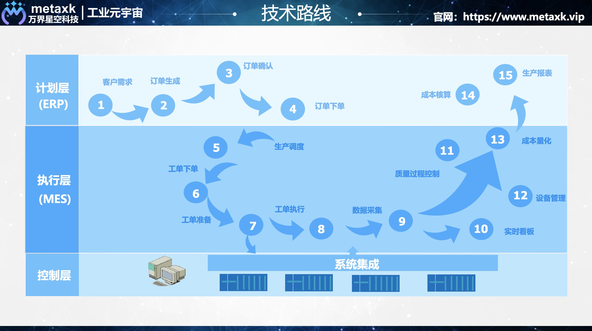

**市面上超级好用的开源MES，支持二次开发**

[](./LICENSE)
[](https://spring.io/projects/spring-boot)
[](https://vuejs.org/)
[](https://www.docker.com/)

</div>

## 📖 简介

Open MES是一款功能完善的制造执行系统（Manufacturing Execution System），专为制造业企业数字化转型而设计。

### ✨ 技术架构
- **后端**: Spring Boot 2.7 + MyBatis-Plus + MySQL 8 + Redis + MinIO
- **前端**: Vue 3 + Element Plus + Vite
- **部署**: Docker + Docker Compose（也有Spring Cloud版本）

### 🎯 核心功能
- 生产订单管理
- 生产排产
- 生产任务管理
- 生产报工
- 设备管理
- 质量管理
- 仓储管理
- 数据大屏

---

## 🚀 快速开始

> 💡 **首次使用？** 查看 [快速开始指南 QUICK_START.md](./QUICK_START.md)

### 方式一：Docker部署（推荐）⭐

```bash
# 1. 克隆项目
git clone <repository-url>
cd open_mes

# 2. 一键启动
docker-compose up -d

# 3. 等待3-5分钟（首次启动需要初始化数据库）

# 4. 访问系统
# 前端地址: http://localhost:48081
# 可用账号: metaxk, xs001, ck001, demo1, test001
# 默认密码: (查看 deployment/data/sql/init.sql)
```

> ⚠️ **注意**: 验证码功能已禁用，如需启用请查看 [docs/CAPTCHA.md](./docs/CAPTCHA.md)

### 方式二：源码开发

详见 [开发文档](./docs/DEVELOPMENT.md)

---

## 📁 目录结构

```
open_mes/
├── deployment/         # 部署配置和脚本
├── src/                # 源代码
│   ├── new_open_mes_server/    # 后端源码
│   └── new_open_mes_front/     # 前端源码
├── docs/               # 文档
│   ├── DEPLOYMENT.md  # 部署文档
│   ├── DEVELOPMENT.md # 开发文档
│   └── NOTES.md       # 注意事项
├── manual/             # 操作手册
├── data/               # 运行时数据
└── docker-compose.yml  # Docker编排配置
```

---

## 📚 文档


## MES系统流程图


## MES功能架构图
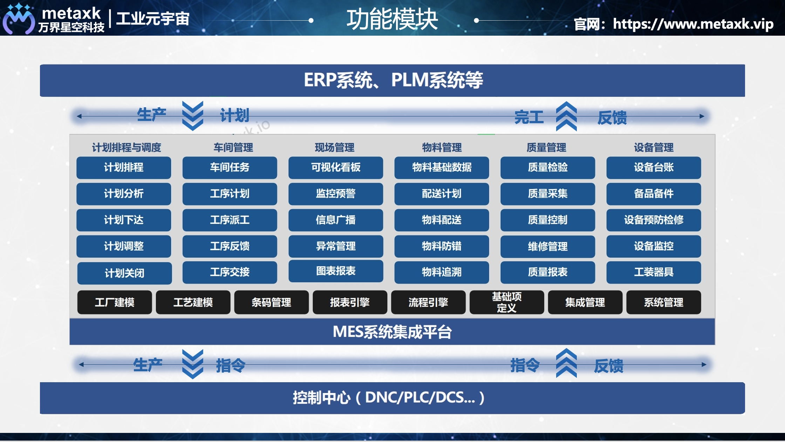

## MES排产功能图
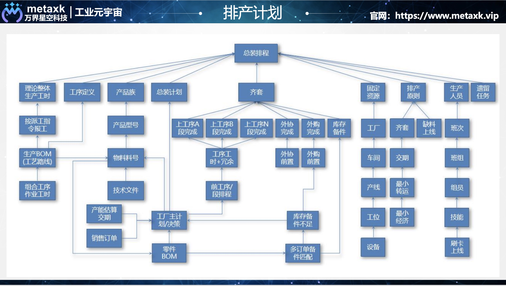

## 排班日历
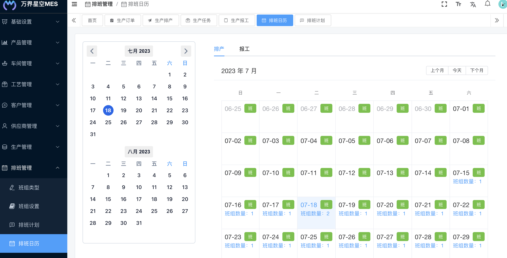

## 排班计划
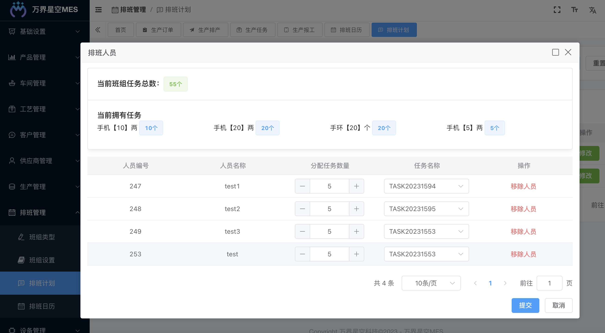

## 生产订单
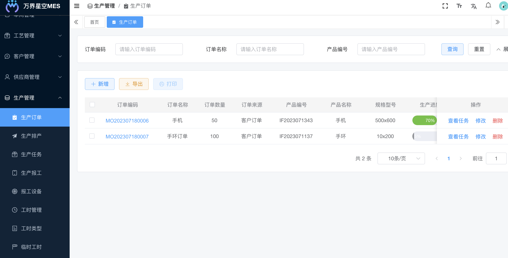

## 生产排产
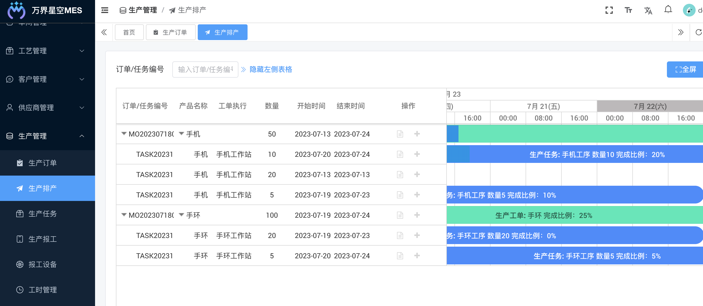

## 生产任务
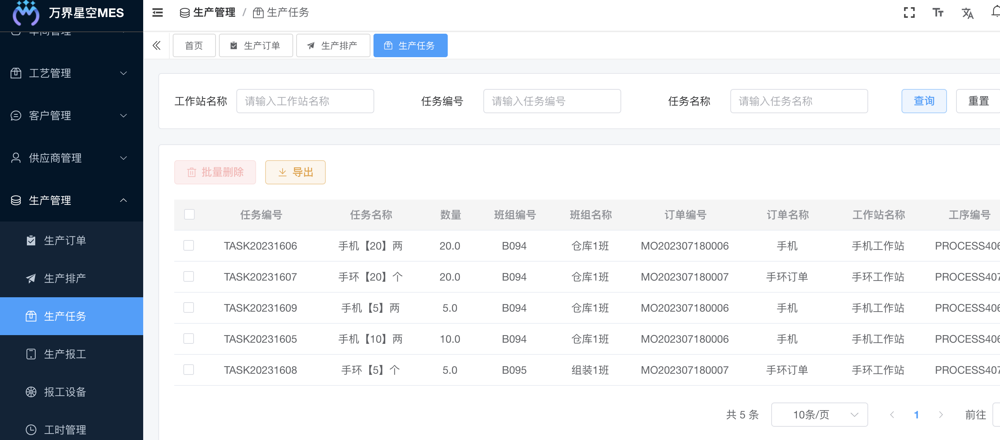

## 生产报工
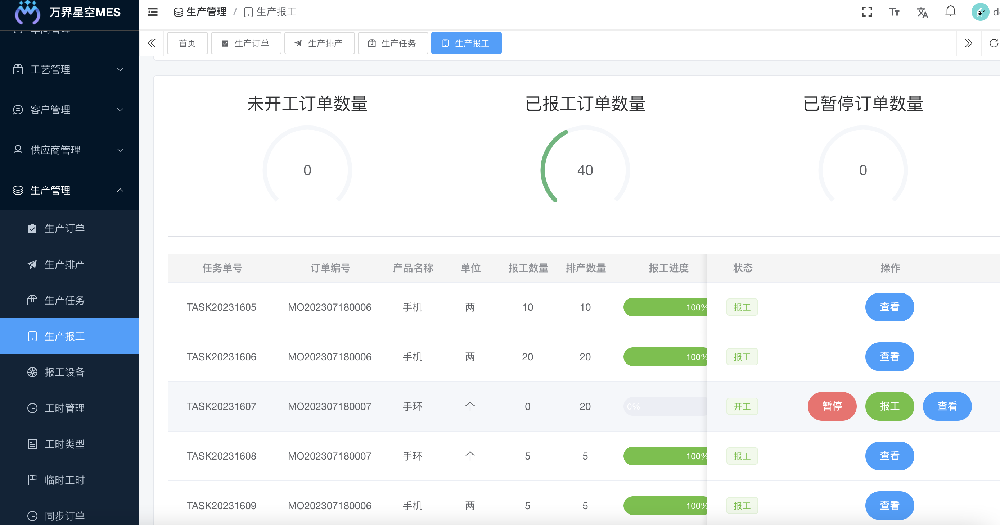

## 数据大屏1
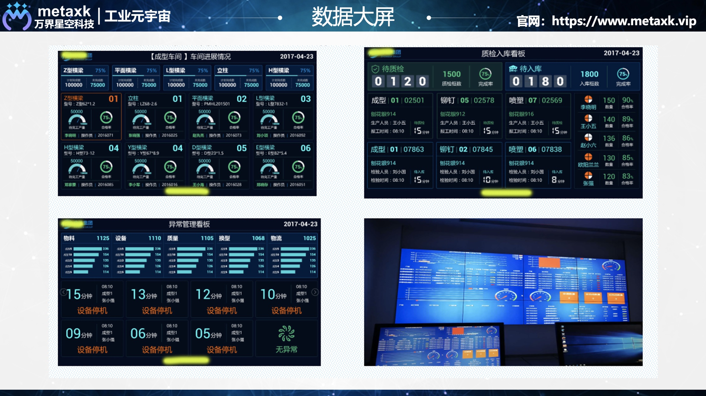

## 数据大屏2
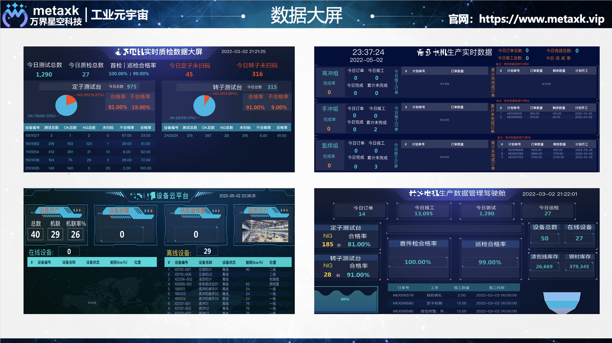


| 文档 | 说明 |
|------|------|
| [部署文档](./docs/DEPLOYMENT.md) | Docker部署、配置说明、故障排查 |
| [开发文档](./docs/DEVELOPMENT.md) | 开发环境搭建、API开发、代码规范 |
| [注意事项](./docs/NOTES.md) | 安全配置、常见问题、性能优化 |
| [操作手册](./manual/) | 完整的用户操作指南（PDF） |

---

## 🎨 系统预览

### 数据大屏


### 生产管理
- **生产订单**: 
- **生产排产**: 
- **生产任务**: 
- **生产报工**: 

---

## 🌐 在线演示

**演示地址**: https://mesv2.cloudmes.io/

**测试账号**:
- 账号: test001 / 密码: 123456
- 账号: test002 / 密码: 123456

---

## ⚙️ 系统配置

### 默认端口
| 服务 | 端口 | 说明 |
|------|------|------|
| 前端 | 48081 | Web界面 |
| 后端API | 48080 | REST API |
| MySQL | 3306 | 数据库 |
| Redis | 6379 | 缓存 |
| MinIO | 9000/9001 | 对象存储 |

### 默认账号
- **系统管理员**: metaxk / 111111
- **数据库root**: root / aa123456
- **Redis密码**: 123456
- **MinIO账号**: admin / admin111

⚠️ **生产环境请务必修改所有默认密码！**

---

## 🛠 技术支持

- 📞 **联系电话**: 17898898894
- 📧 **技术交流**: 欢迎提Issue和PR
- 📖 **详细文档**: 查看 `docs/` 目录
- 🎓 **操作手册**: 查看 `manual/` 目录

---

## ⭐ Star History

**开源不易，努力坚持！如果这个项目对您有帮助，请给我们一个Star⭐**

---

## 📄 开源协议

本项目采用 [MIT License](./LICENSE) 开源协议。

Copyright © 2025 万界星空科技

---

## 🙏 致谢

感谢所有为这个项目做出贡献的开发者！